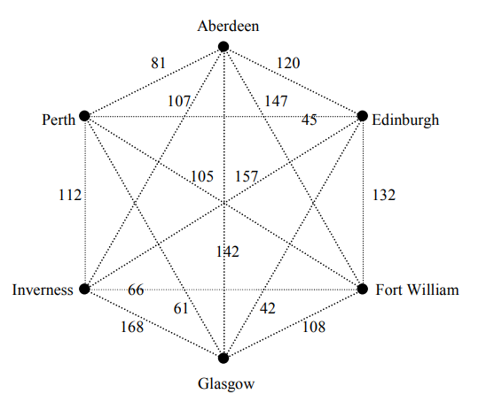

# Lecture1-Algorithm

# 最小生成树-Prim算法

Prim算法是一种用于求解最小生成树（Minimum Spanning Tree）的贪心算法。最小生成树是一棵包含了图中所有顶点且边权重之和最小的树。

Prim算法的基本思想是从一个起始顶点开始，逐步扩展最小生成树的边集合，直到包含了图中所有的顶点。具体步骤如下：

1. 初始化一个空的最小生成树边集合和一个顶点集合。
2. 选择一个起始顶点，将其加入顶点集合。
3. 从起始顶点出发，选择与当前最小生成树连接的最小权重边，并将其加入最小生成树边集合。
4. 将新加入的顶点也加入顶点集合。
5. 重复步骤3和步骤4，直到所有的顶点都被加入顶点集合。
6. 最终得到的最小生成树边集合即为所求。

Prim算法的核心在于每次选择与当前最小生成树连接的最小权重边。可以使用优先队列（最小堆）来维护当前连接的边的权重，并选择权重最小的边。



该图最小总权重为339

# 伪代码-PSEUDOCODE

伪代码（Pseudocode）是一种用于描述算法思想和逻辑的简化描述方法，通常采用类似编程语言的结构和语法来表达。它不是一种具体的编程语言，而是一种用于展示算法步骤和逻辑的中间形式。

伪代码的主要目的是使算法的描述更易读、易懂和易于实现。它是一种高级描述语言，允许算法设计者以一种接近自然语言的方式描述算法的逻辑结构，而无需关注具体的编程细节和语法。

```PSEUDOCODE
begin
statements to perform operations
statements to control order of execution
end
```

## 条件语句-CONDITIONAL STATEMENT

```PSEUDOCODE
begin
if condition then statement
end
```

or

```PSEUDOCODE
begin
if condition then statement 1
else statement 2
end
```

# 循环语句-ITERATIVE STATEMENTS or LOOPS

The for-do loop

```PSEUDOCODE
for variable := initial value to final value do
statement
```

The while loop

```PSEUDOCODE
while expression do statement
```

The repeat-until loop

```PSEUDOCODE
repeat
statement 1;
statement 2;
......
......
statement n;
until condition
```

‍
