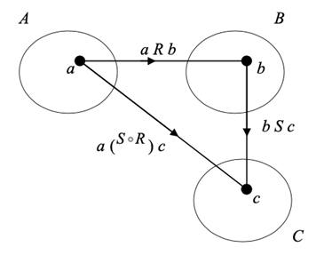
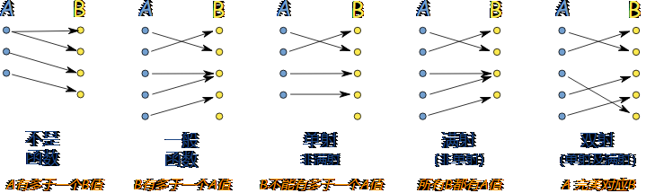

# Lecture7-Functions

# 逆关系INVERSE RELATION

在数学中，逆关系（inverse relation）指的是与给定二元关系具有相反性质的关系。

具体而言，对于一个二元关系 R，如果对于 R 中的每个有序对 (a, b)，存在有序对 (b, a) 也属于 R，则称关系 R 的逆关系为 R⁻¹。

换句话说，逆关系是将二元关系中的元素对的顺序颠倒得到的新关系。如果关系 R 包含有序对 (a, b)，则逆关系 R⁻¹ 将包含有序对 (b, a)。逆关系的存在取决于原始关系是否满足对称性。

例如，考虑一个关系 R 定义在整数集合上，其中 R 包含有序对 (a, b)，表示 a 大于等于 b。则 R 的逆关系 R⁻¹ 包含有序对 (b, a)，表示 b 小于等于 a。在这种情况下，逆关系 R⁻¹ 与原始关系 R 具有相反的性质。

给定集合 A 和集合 B 之间的关系 R，逆关系 R⁻¹ 的定义如下：

对于 R 中的每个有序对 (a, b)，有序对 (b, a) 属于 R⁻¹。换句话说，逆关系 R⁻¹ 是通过颠倒 R 中的每个有序对的顺序得到的。

‍

# 复合关系composition relation

在数学中，composition relation指的是两个函数的复合运算关系，也称为函数复合。如果有两个函数f和g，它们都从某个集合A到另一个集合B的映射，那么它们的复合函数可以表示为(g ◦ f)(x)，意思是先用f将x映射到B中的某个元素，再用g将这个元素映射到另一个集合C中的元素，最终得到(g ◦ f)(x)在C中的值。

具体而言，如果f的定义域是集合A，值域是集合B，g的定义域是集合B，值域是集合C，那么它们的复合函数g ◦ f的定义域是A，值域是C，表示为：

(g ◦ f)(x) = g(f(x))，其中x ∈ A

可以将复合函数看作是从A到C的一种新的映射，将两个函数的作用组合在一起，使得复合函数的输出值由第一个函数的输出作为第二个函数的输入来计算。复合函数可以用于解决许多数学问题，例如函数的逆、导数、微积分和组合数学等。

A function is a special type of binary relation. Before defining a function we look at two ways of generating new relations from existing ones.

Given a relation *R* between sets *A* and *B*, the **INVERSE RELATION** $R^{-1}$ between *B* and *A* is given by

$R^{-1}={{(b,a):(a,b)\in R}}$  

e.g.

$(1,2)∈R$

$(2,1) \in R^{-1}$  

​For example, the inverse of the relation *is a parent of* on the set of all people is *is a child of*.

$(Parent4, Child 1) \in R: is \,a \,parent \,of$

$(Child1,Parent4) \in R:is\,a\,child \,of$  

In graphical terms, the inverse of a relation is obtained by reversing all the arrows in the digraph of the original relation.

‍

Now let *R* be a relation between sets *A* and *B*, and *S* be a relation between *B* and a third set *C*. Suppose that elements *a* in *A*, *b* in *B* and *c* in *C* are such that *a* is *R*- related to *b* and *b* is *S*-related to *c*. Then *a* is related to *c* by a new relation that is a combination of the two relations *R ​*​**and ​**​*S*.

‍

This new relation between *A* and *C* is called the **COMPOSITION** of *R* and *S* and is denoted (rather bizarrely at first sight) by $S\circ R$​

‍

Formally

$S\circ R=\ {(a,c):a\ R\ b\ and\ b\ S\ c\ for\ some\ b\in B}$

# Injective,surjective,bijective

​

单射，满射，双射的相关文档请查看数学乐官网：https://www.shuxuele.com/sets/injective-surjective-bijective.html

## Injective（单射）

函数的单射性（或称为一一映射性）是指函数中的每个不同的输入元素都有不同的输出元素与之对应。

换句话说，一个函数是单射的，如果不同的输入值对应着不同的输出值，也就是说，函数的映射是一对一的关系。

简单来说，函数的单射性意味着每个输入都有唯一的对应输出，不会存在两个不同的输入对应到同一个输出。

函数的单射性有以下基本特性：

1. 不同的输入对应不同的输出：对于任意的输入元素，如果它们不相同，则它们对应的输出元素也不相同。
2. 唯一性：每个输入元素都有唯一的对应输出元素。
3. 逆映射：对于一个单射函数，存在一个逆函数，可以将输出元素映射回输入元素。

单射函数的直观理解是每个输入都有自己独特的输出，不会发生映射冲突。这在数学和实际问题中具有重要意义，可以确保信息不丢失，并且允许我们根据输出值反推回输入值。

## 例子

例如，函数f(x) = x^2^不是单射的，因为它将两个不同的输入值映射到相同的输出值。例如，f(2) = 4，f(-2) = 4。但是函数g(x) = x^3^是单射的，因为它将任何两个不同的输入值映射到不同的输出值。

一个简单的例子是函数 f(x) = 2x，其中定义域和值域都是实数集。

这个函数的特点是，不同的输入对应不同的输出。无论是哪两个不同的实数 a 和 b，只要 a ≠ b，那么 f(a) ≠ f(b)。换句话说，对于任意不同的实数 a 和 b，它们的函数值 f(a) 和 f(b) 也是不同的。

# Surjective（满射）

满射是指一个函数的映射范围覆盖了其值域的所有元素，也就是说，对于函数的每个输出值，至少存在一个输入值与之对应。

简单来说，一个函数是满射的，当且仅当它的映射能够“映满”整个值域，每个可能的输出值都至少有一个对应的输入值。

## 例子

考虑一个函数$f(x) = x^2$，其中定义域和值域都是非负实数集。

这个函数的特点是，它可以将任意非负实数平方得到一个非负实数作为输出。也就是说，对于函数的每个非负实数 $y$，都至少存在一个非负实数 $x$，使得 $f(x) = x^2 = y$。

举个具体的例子： 当 $y = 4$ 时，可以取 x = 2 或 $x = -2$，因为 2^2 = 4 和 (-2)^2 = 4。所以函数 $f(x) = x^2$是满射函数，因为对于任意非负实数 y，都存在至少一个非负实数 x，使得 f(x) = y。

‍

当函数具有不同的特性时，它们对应的示例可以如下：

1. Surjective（满射）的例子： 例如，函数f(x) = x^2^不是满射的，因为它的值域是[0, ∞)，而不包括负数。但是函数g(x) = sin(x)是满射的，因为它的值域是[-1,1]，包括了所有的目标域。
2. Bijective（双射）的例子： 例如，函数f(x) = x + 1是双射的，因为它将不同的输入值映射到不同的输出值，并且将所有的输出值都映射到。另一个例子是函数g(x) = e^x^​，也是双射的，因为它将所有的实数映射到正实数。

要证明一个函数是单射（injective）、满射（surjective）还是双射（bijective），需要分别验证以下条件：

**单射（Injective）：**

一个函数是单射，如果对于不同的输入元素，它们的映射结果不相同。换句话说，对于函数 f 的任意两个不同的输入 a 和 b，如果 f(a) ≠ f(b)，则函数 f 是单射。

验证函数 f 是单射的一种方法是通过比较输入元素的映射结果。可以使用数学推理、代数运算或者逻辑推理进行证明。

或者：假设$f(x_1)=f(x_2)$，证明$x_1=x_2$

**满射（Surjective）：**

一个函数是满射，如果对于值域中的每一个元素，都存在至少一个输入元素与之对应。换句话说，对于函数 f 的值域中的每一个元素 y，都存在一个输入元素 x，使得 f(x) = y。

要证明函数 f 是满射，需要对值域中的每个元素进行检查，并找到对应的输入元素。

**双射（Bijective）：**

一个函数是双射，如果它既是单射又是满射。若证明函数为双射，则需证明函数是双射并且是满射的。

‍

假设我们有一个函数 $f: R → R$，定义为$f(x) = 2x$，其中 R 表示实数集合。

我们想证明函数 f 是满射，即对于值域 R 中的每个实数 $y$，都存在一个实数 $x$，使得 $f(x) = y$。

证明过程如下：

1. 假设 y 是任意一个实数，我们需要找到一个实数 x，使得$f(x) = y$。
2. 根据函数的定义，我们有 $f(x) = 2x$。因此，我们需要找到一个 $x$，使得 $2x = y$。
3. 解方程 $2x = y$，我们得到$x = \frac{1}{2}y$。
4. 现在我们找到了一个实数 $x =\frac{1}{2}y$，使得 f(x) = 2x = 2(y/2) = y。
5. 因此，对于值域 R 中的任意实数 y，我们找到了一个实数 x = y/2，使得 f(x) = y。
6. 因此，我们证明了对于任意实数 y，都存在一个实数 x，使得 f(x) = y。
7. 因此，函数 f 是满射。

通过解方程并找到适当的输入元素，我们证明了对于函数 f，对于值域中的每个实数 y，都存在至少一个输入元素 x，使得 f(x) = y。因此，函数 f 是满射。

‍

‍
